# Medium Blog Project
- Blog App의 간략한 동작을 Insomnia를 통해 확인해보았습니다.
- 참고한 사이트는 [medium.com](https://medium.com/)입니다.

# User
- User url 구성은 다음과 같습니다.
- 기본적으로 localhost:8000/user/ 뒤에서 시작합니다.

|name|url|method|
|-|-|-|
|SIGNUP|signup/|POST|
|LOGIN|login/|POST|
|PROFILE|profile/|GET|

## SIGNUP
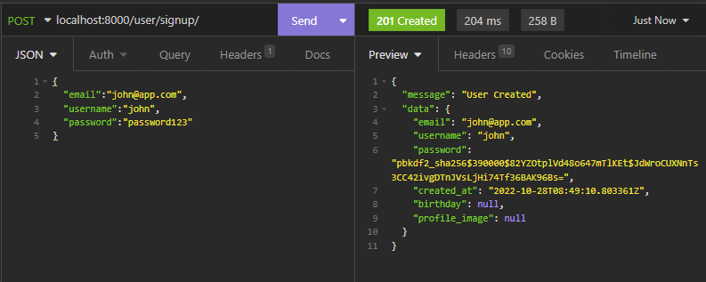
- 회원가입 수행(비밀번호 암호화)

## LOGIN
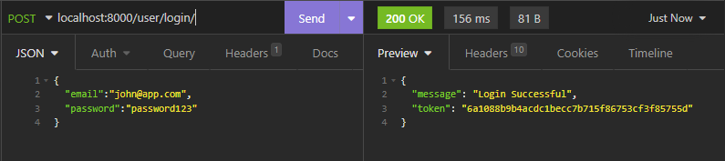
- 로그인 수행(토큰 획득)

## PROFILE
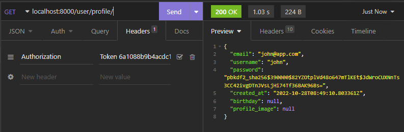
- 해당 유저 프로필 보여주기
- IsAuthenticated만 가능

# Blog
- Blog url 구성은 다음과 같습니다.
- 기본적으로 localhost:8000/blog/ 뒤에서 시작합니다.

## POST
- 아래는 POST에 해당하는 기능들입니다.

|name|url|method|
|-|-|-|
|POST CREATE|post/|POST|
|POST LIST|post/|GET|
|POST GET|post/<int:pk>/|GET|
|POST UPDATE|post/<int:pk>/|PUT|
|POST DELETE|post/<int:pk>/|DELETE|

### CREATE
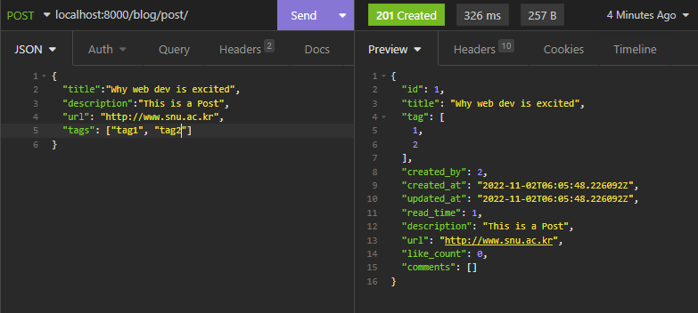
- POST 작성
- 로그인한 경우에만 작성 가능

### LIST
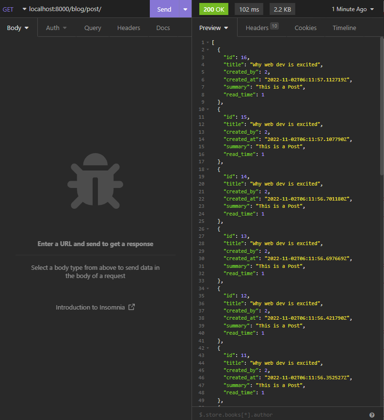
- POST 목록 불러오기
- description의 300자 분량을 summary로 불러옴

### GET
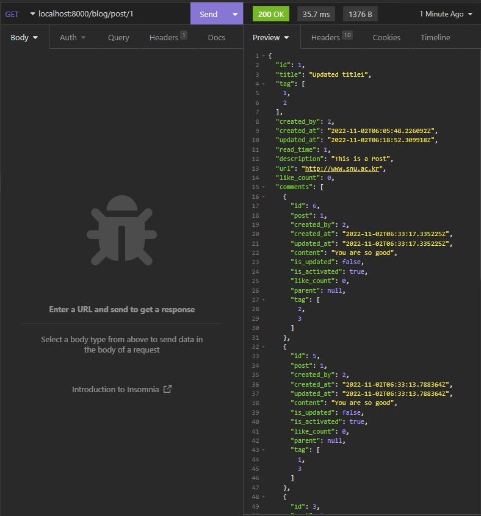
- 해당 POST 세부정보 가져오기
- POST의 COMMENT들도 같이 불러옴

### UPDATE
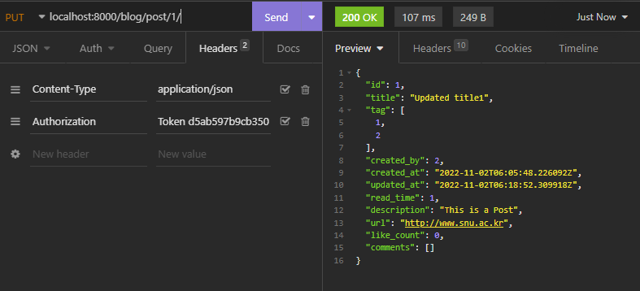
- 해당 POST 수정
- 작성자만 수정가능

### DELETE
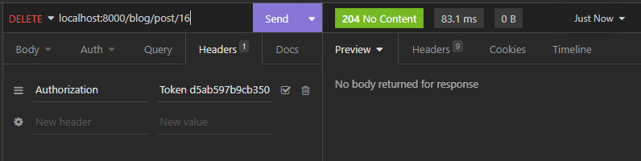
- 해당 POST 삭제
- 작성자만 삭제가능

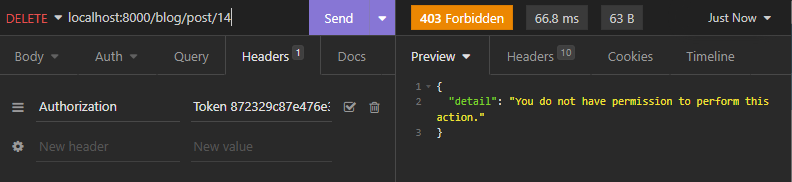
- 로그인 안하고 삭제 시도시 에러
- 다른 유저가 삭제 시도시 에러
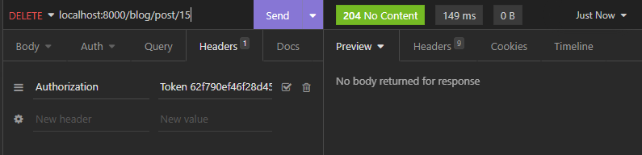
- 어드민은 삭제 가능

## COMMENT
- 아래는 COMMENT에 해당하는 기능들입니다.

|name|url|method|
|-|-|-|
|COMMENT CREATE|post/<int:pk>/comment/|POST|
|COMMENT LIST|post/<int:pk>/comment/|GET|
|COMMENT UPDATE|post/<int:pid>/comment/<int:cid>/|PUT|
|COMMENT DELETE|post/<int:pid>/comment/<int:cid>/|DELETE|

### CREATE
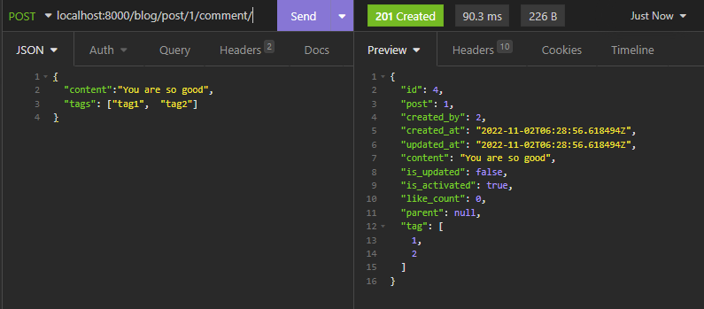
- 특정 POST의 COMMENT 작성
- 로그인한 경우에만 작성 가능
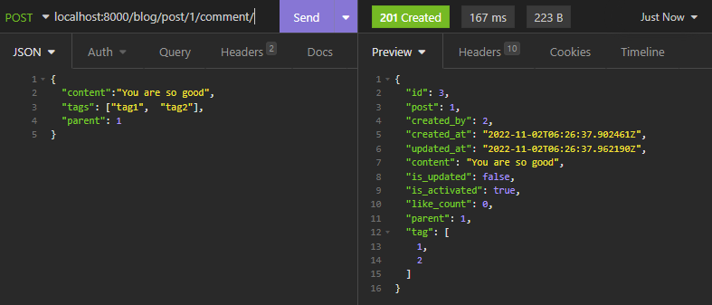
- 이미 존재하는 COMMENT를 parent로 지정하기 가능(없을시 404에러 발생)
- 상위 COMMENT가 삭제시 같이 삭제되게 구현함
- 같이 삭제되지 않게하기 위해서는 models.PROTECT로 구현해야 할 것 같음

### LIST
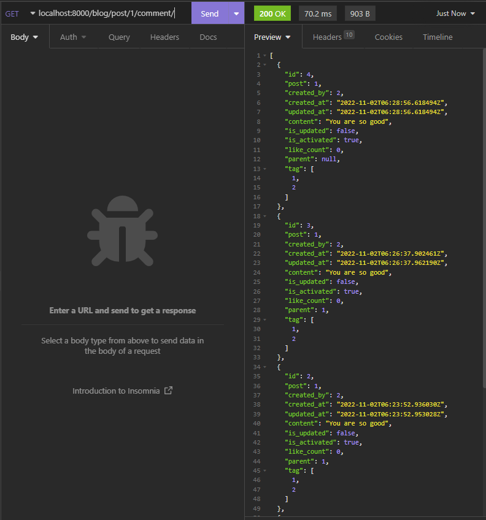
- 특정 POST의 COMMENT 목록 불러오기

### UPDATE
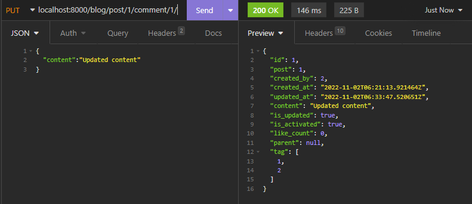
- 해당 COMMENT 수정
- 작성자만 수정가능

### DELETE

- 해당 COMMENT 삭제
- 작성자만 삭제가능

## TAG
- 아래는 TAG에 해당하는 기능들입니다.
- POST와 COMMENT는 여러개의 TAG를 가질 수 있습니다.

|name|url|method|
|-|-|-|
|TAG LIST|tag/|GET|
|POST LIST by TAG|tag/<str:tag_name>/post/|GET|
|COMMENT_LIST by TAG|tag/<str:tag_name>/comment/|GET|

### LIST
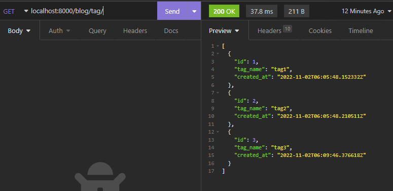
- 모든 존재하는 TAG 목록 출력

### LIST POST by TAG
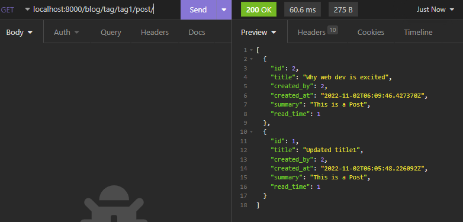
- 특정 TAG에 해당하는 POST 모두 출력

### LIST COMMENT by TAG
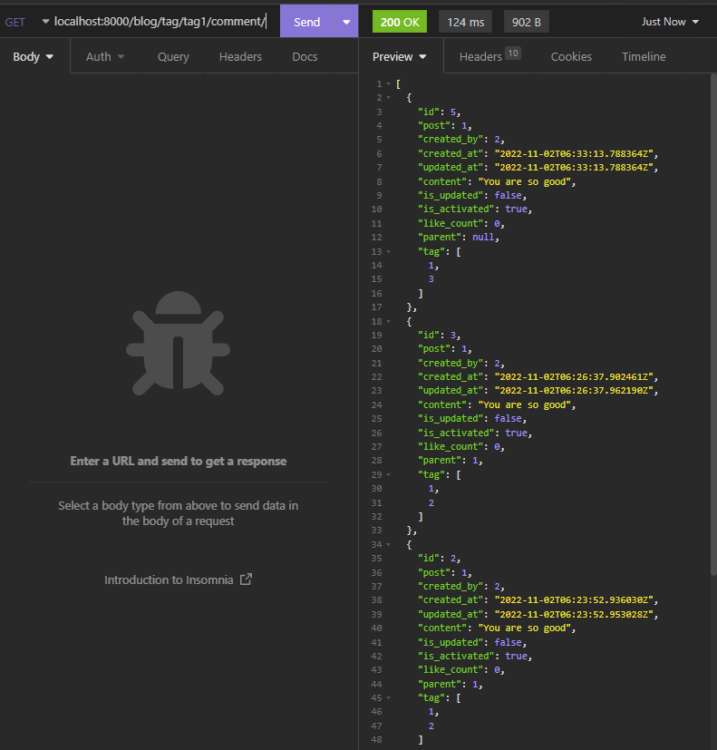
- 특정 TAG에 해당하는 COMMENT 모두 출력
